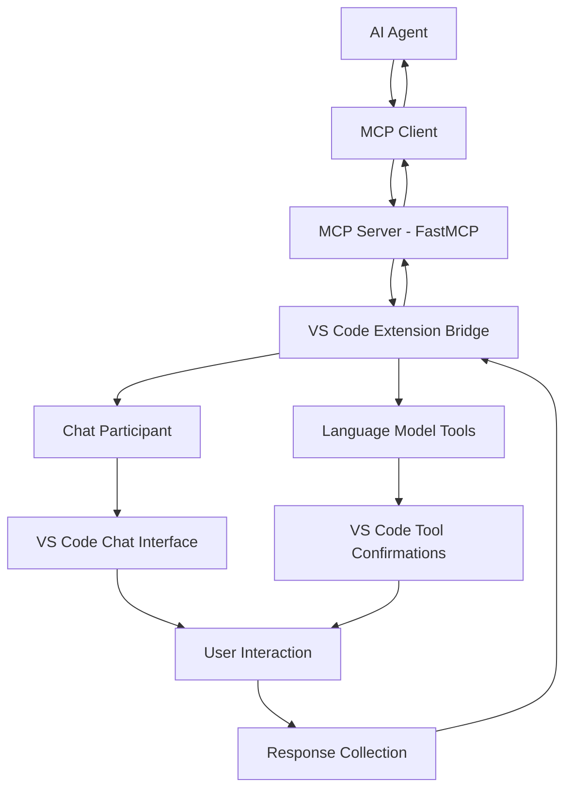

# Human-In-the-Loop Migration Strategy: From tkinter to VS Code Integration

## Executive Summary

This document outlines the comprehensive migration strategy for transforming the Human-In-the-Loop MCP Server from a tkinter-based external GUI system to a native VS Code integrated experience. The migration leverages VS Code's Chat Participants API and Language Model Tools to provide seamless human-AI collaboration within the editor environment.

## Current State Analysis

### tkinter Implementation Limitations

**Technical Issues:**
- **External Window Interruption**: tkinter dialogs create separate OS windows that break VS Code workflow
- **Platform Dependencies**: Complex cross-platform GUI code with OS-specific optimizations
- **Threading Complexity**: GUI operations require careful thread management to avoid blocking
- **Limited Context**: External dialogs lose connection to active VS Code workspace context
- **Poor Integration**: No access to VS Code's theming, settings, or UI conventions

**User Experience Problems:**
- **Workflow Disruption**: Users must switch focus between VS Code and external dialog windows
- **Context Loss**: No visual connection between dialog and code being worked on
- **Accessibility**: Limited accessibility support compared to VS Code's native UI
- **Inconsistent UX**: Dialogs don't match VS Code's look and feel

### Current Tool Capabilities

The existing MCP server provides these interaction patterns:
- `get_user_input` - Single-line text/number input
- `get_user_choice` - Multiple choice selections
- `get_multiline_input` - Long-form text input
- `show_confirmation_dialog` - Yes/no confirmations
- `show_info_message` - Information display
- `health_check` - Server status monitoring

## Target Architecture: VS Code Native Integration

### Approach 1: Chat Participants (Primary Strategy)

**Implementation Details:**
- **Chat Participant ID**: `@human-loop` for easy invocation
- **Integration Pattern**: Use VS Code Chat API to handle all user interactions
- **Context Preservation**: Maintain workspace context and file references
- **Rich Responses**: Support markdown, code blocks, and interactive elements

**Technical Benefits:**
- Seamless integration with VS Code's chat interface
- Access to workspace context and file system
- Rich markdown responses with syntax highlighting
- Native VS Code theming and accessibility
- No external dependencies or GUI frameworks

**Code Example Structure:**
```typescript
const participant = vscode.chat.createChatParticipant('human-loop', async (request, context, stream, token) => {
  // Handle different interaction types based on request.prompt
  if (request.prompt.includes('confirm')) {
    return handleConfirmation(request, stream);
  } else if (request.prompt.includes('input')) {
    return handleInput(request, stream);
  }
  // ... other patterns
});
```

### Approach 2: Language Model Tools (Complementary Strategy)

**Implementation Details:**
- **Tool Registration**: Define tools in `package.json` and implement via Language Model API
- **Agent Mode**: Tools automatically invoked by AI agents when needed
- **Confirmation Flow**: Built-in confirmation dialogs for user approval
- **Deep Integration**: Access to editor state, selections, and workspace

**Tool Definition Example:**
```json
{
  "contributes": {
    "languageModelTools": [
      {
        "name": "get-user-confirmation",
        "description": "Ask user for confirmation before proceeding with an action",
        "parameters": {
          "type": "object",
          "properties": {
            "message": {
              "type": "string",
              "description": "Confirmation message to display"
            }
          }
        }
      }
    ]
  }
}
```

## Migration Implementation Plan

### Phase 1: Foundation Setup (Week 1-2)

**1.1 VS Code Extension Scaffold**
```bash
yo code  # VS Code extension generator
# Configure TypeScript, Chat API, Language Model API dependencies
```

**1.2 Basic Chat Participant**
- Create minimal `@human-loop` chat participant
- Implement basic message routing
- Set up workspace context access
- Test basic interaction patterns

**1.3 MCP Server Integration Bridge**
- Create communication layer between VS Code extension and MCP server
- Implement message passing protocol
- Set up error handling and fallback mechanisms

### Phase 2: Core Tool Migration (Week 3-4)

**2.1 Input Collection Tools**

**Chat-based Input Collection:**
```typescript
async function handleUserInput(request: vscode.ChatRequest, stream: vscode.ChatResponseStream) {
  // Parse request for input type and prompt
  const inputType = extractInputType(request.prompt);
  const prompt = extractPrompt(request.prompt);
  
  // Create interactive input request
  if (inputType === 'text') {
    stream.markdown(`**Input Required**: ${prompt}\n\nPlease provide your response:`);
    return await waitForUserResponse(stream);
  }
}
```

**Language Model Tool Implementation:**
```typescript
vscode.lm.registerTool('get-user-input', async (parameters, token) => {
  const { prompt, inputType } = parameters;
  
  // Show confirmation dialog with input field
  const result = await vscode.window.showInputBox({
    prompt: prompt,
    placeHolder: `Enter ${inputType} value`,
    validateInput: (value) => validateInput(value, inputType)
  });
  
  return { success: true, value: result };
});
```

**2.2 Choice Selection Tools**

**Chat-based Multiple Choice:**
```typescript
async function handleUserChoice(request: vscode.ChatRequest, stream: vscode.ChatResponseStream) {
  const choices = extractChoices(request.prompt);
  const prompt = extractPrompt(request.prompt);
  
  stream.markdown(`**${prompt}**\n\nSelect an option:`);
  choices.forEach((choice, index) => {
    stream.button({
      command: 'human-loop.selectChoice',
      arguments: [index, choice],
      title: `${index + 1}. ${choice}`
    });
  });
}
```

**2.3 Confirmation Dialogs**

**Integrated Confirmation:**
```typescript
async function handleConfirmation(request: vscode.ChatRequest, stream: vscode.ChatResponseStream) {
  const message = extractMessage(request.prompt);
  
  stream.markdown(`**Confirmation Required**\n\n${message}`);
  stream.button({
    command: 'human-loop.confirm',
    arguments: [true],
    title: '✅ Yes, proceed'
  });
  stream.button({
    command: 'human-loop.confirm', 
    arguments: [false],
    title: '❌ No, cancel'
  });
}
```

### Phase 3: Enhanced Integration (Week 5-6)

**3.1 Workspace Context Integration**
- File reference handling in chat responses
- Code snippet inclusion and syntax highlighting
- Workspace-aware suggestions and completions

**3.2 Progress Notifications**
- Real-time status updates in chat
- Progress bars for long-running operations
- Error handling with actionable suggestions

**3.3 Rich Interactive Elements**
- Inline code execution buttons
- File diff previews
- Interactive forms within chat interface

### Phase 4: Migration and Cleanup (Week 7-8)

**4.1 Backward Compatibility**
- Maintain MCP server API compatibility
- Feature flag for GUI vs VS Code mode
- Gradual deprecation of tkinter dependencies

**4.2 Performance Optimization**
- Chat response streaming optimization
- Memory usage improvements
- Tool invocation latency reduction

**4.3 Documentation and Testing**
- Migration guide for existing users
- Comprehensive test suite for VS Code integration
- Performance benchmarking and comparison

## Technical Architecture

### Communication Flow



### Data Models

**Chat Request Structure:**
```typescript
interface HumanLoopChatRequest {
  type: 'input' | 'choice' | 'confirmation' | 'info';
  prompt: string;
  options?: string[];
  inputType?: 'text' | 'number' | 'multiline';
  context?: {
    fileUri?: vscode.Uri;
    selection?: vscode.Range;
    workspaceFolder?: vscode.WorkspaceFolder;
  };
}
```

**Tool Response Structure:**
```typescript
interface HumanLoopToolResponse {
  success: boolean;
  value?: any;
  error?: string;
  metadata?: {
    timestamp: string;
    responseTime: number;
    context: any;
  };
}
```

## Migration Benefits

### Developer Experience Improvements

**Seamless Workflow:**
- No context switching between VS Code and external windows
- Conversations preserved in chat history
- Integration with VS Code's command palette and shortcuts

**Enhanced Productivity:**
- Rich markdown responses with syntax highlighting
- Inline code execution and file operations
- Workspace-aware suggestions and autocompletion

**Better Collaboration:**
- Chat history provides audit trail of decisions
- Easy sharing of interaction sessions
- Integration with VS Code's collaboration features

### Technical Advantages

**Reduced Complexity:**
- Eliminate tkinter dependencies and cross-platform GUI code
- Simplified threading model with VS Code's async APIs
- Native accessibility and internationalization support

**Improved Reliability:**
- VS Code handles UI rendering and window management
- Built-in error handling and recovery mechanisms
- Automatic scaling with VS Code performance optimizations

**Future-Proof Architecture:**
- Leverage VS Code's evolving AI integration capabilities
- Easy integration with new language models and AI tools
- Extensible through VS Code's rich extension ecosystem

## Success Metrics

### User Experience Metrics
- **Response Time**: < 200ms for chat participant activation
- **User Satisfaction**: > 90% positive feedback on workflow integration
- **Adoption Rate**: > 80% of users migrate to VS Code integration within 3 months

### Technical Metrics
- **Error Rate**: < 0.5% for tool invocations
- **Performance**: No measurable impact on VS Code startup or operation
- **Memory Usage**: < 10MB additional memory footprint

### Migration Metrics
- **Code Reduction**: > 60% reduction in GUI-related code
- **Dependency Reduction**: Eliminate tkinter and platform-specific dependencies
- **Maintainability**: > 50% reduction in bug reports related to GUI issues

## Risk Mitigation

### Technical Risks
- **VS Code API Changes**: Monitor VS Code release notes and maintain compatibility
- **Performance Impact**: Continuous monitoring and optimization
- **User Adoption**: Provide comprehensive migration guide and support

### Compatibility Risks
- **Existing Integrations**: Maintain MCP server API compatibility during transition
- **Different VS Code Versions**: Test across supported VS Code version range
- **Platform Differences**: Ensure consistent behavior across Windows, macOS, Linux

## Timeline and Milestones

### Sprint Breakdown

**Sprint 1 (Weeks 1-2): Foundation**
- VS Code extension scaffold
- Basic chat participant implementation
- MCP server integration bridge

**Sprint 2 (Weeks 3-4): Core Migration**
- All existing tools converted to VS Code integration
- Comprehensive testing and debugging
- Performance optimization

**Sprint 3 (Weeks 5-6): Enhancement**
- Rich interactive features
- Workspace context integration
- Advanced error handling

**Sprint 4 (Weeks 7-8): Production**
- Migration documentation
- Backward compatibility maintenance
- Release preparation and testing

### Key Deliverables

1. **VS Code Extension**: Full-featured extension with chat participant and language model tools
2. **Migration Guide**: Comprehensive documentation for users transitioning from tkinter
3. **API Documentation**: Updated MCP server documentation with VS Code integration examples
4. **Test Suite**: Comprehensive automated testing for all integration scenarios

## Conclusion

This migration strategy transforms the Human-In-the-Loop MCP Server from a disruptive external GUI system to a seamless VS Code-integrated experience. By leveraging VS Code's Chat Participants API and Language Model Tools, we provide users with a superior development workflow while reducing technical complexity and maintenance overhead.

The phased approach ensures minimal disruption to existing users while providing a clear path toward a more modern, integrated, and maintainable architecture. The result will be a human-AI collaboration tool that feels native to the VS Code environment and sets a new standard for developer experience in AI-assisted coding workflows.